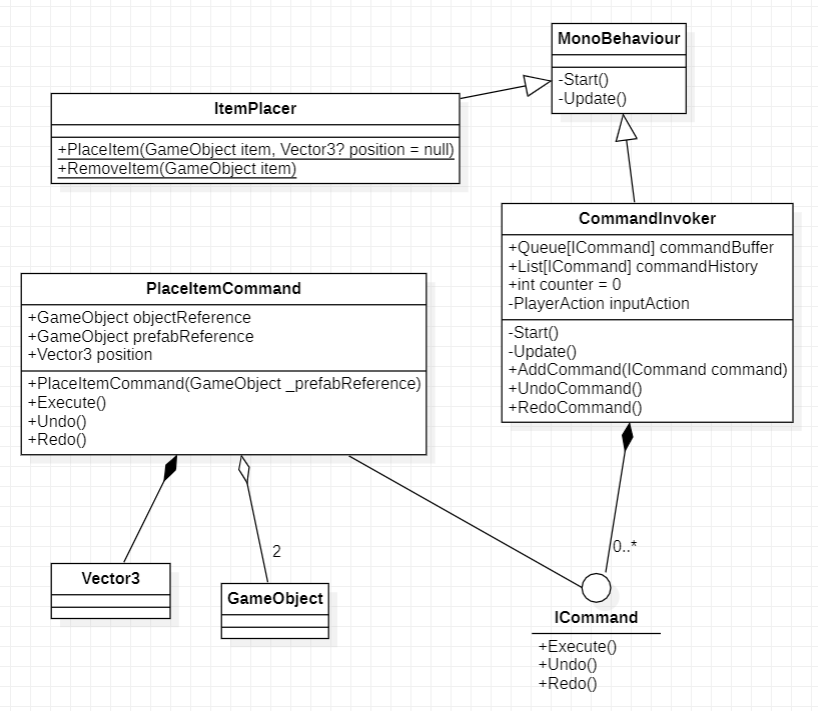
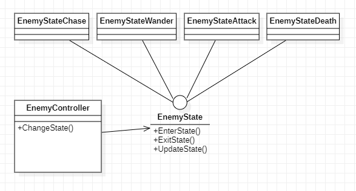
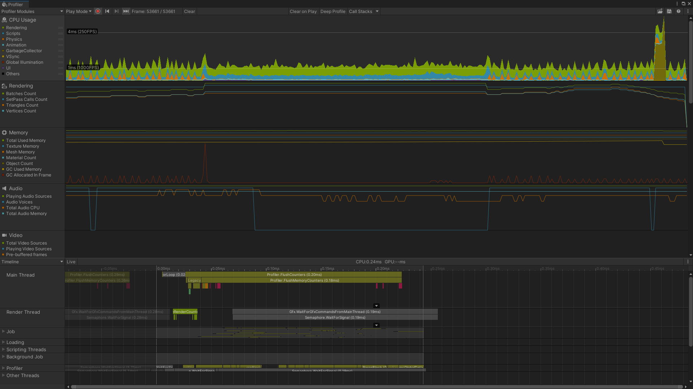
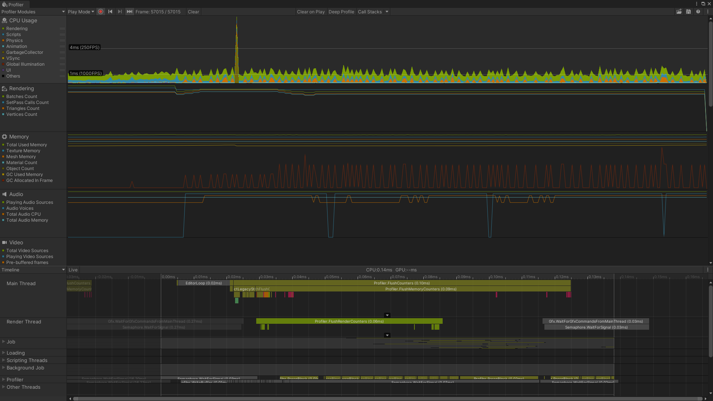

# INFR3110U-Project
 
Contribution PDF in [Kyle's branch](../Kyle/Group%20Assignment%201%20-%20F2022%20clarification.pdf).

Build in [Main branch](../main/INFR3110U-Project.7z).

Video Explaination:

Slidedeck of team members:

Command Pattern UML:

State Pattern UML:

Profiling of Object Pooling:
------
With:

Without:

