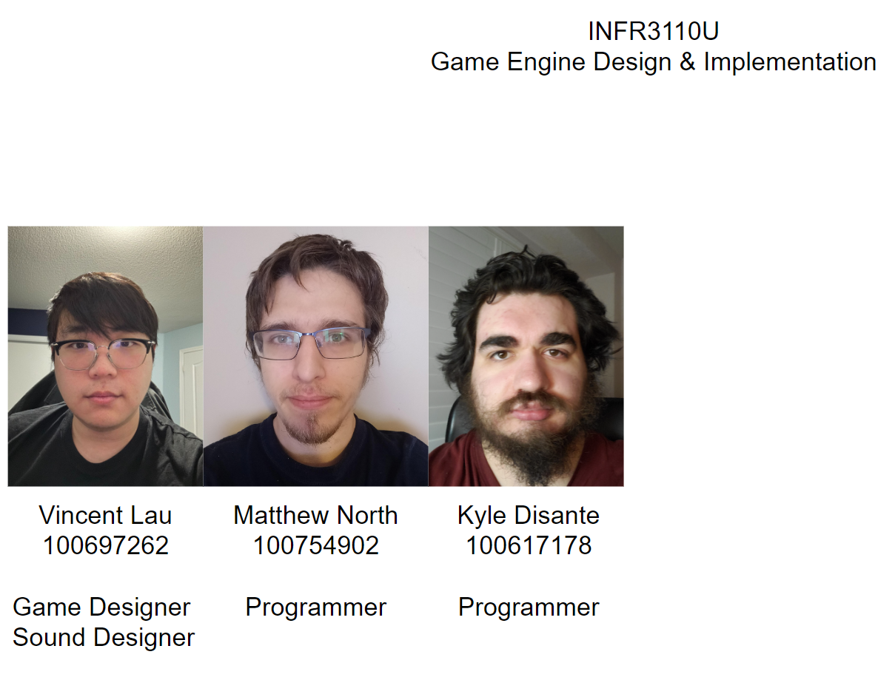

# INFR3110U-Project

[Contributions PDF](Information/Contributions_Appendix.pdf),
[Build](INFR3110U-Project.zip)

Video Explaination:

Slidedeck of team members:

Command Pattern UML:

State Pattern UML:

Profiling of Object Pooling:
-----
With:

Without:

